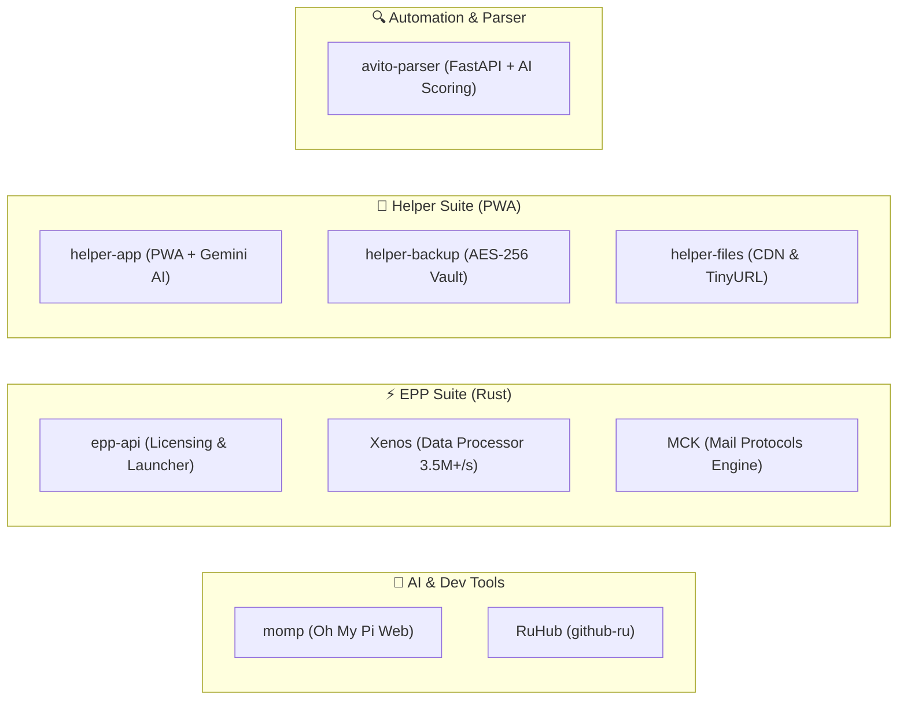

# 👋 Привет, я @domovoyproj!

  

  
  
  

Разрабатываю высокопроизводительные многопоточные утилиты на **Rust**, современные десктоп/веб-приложения с интеграцией **ИИ-агентов** и защищённые персональные PWA-экосистемы.

---

## 🗂️ Экосистемы и группы проектов

---

### 🤖 1. Искусственный интеллект и инструменты разработчика
> Современные решения для взаимодействия с большими языковыми моделями (LLM) и улучшения опыта разработки.

| Проект | Стек | Описание |
| :--- | :--- | :--- |
| 🚀 [**momp**](https://github.com/domovoyproj/momp) | `Next.js 16` • `TypeScript` • `Bun` • `Tauri v2` | **Полнофункциональный веб-интерфейс и десктоп-клиент** для [Oh My Pi (omp-web)](https://github.com/can1357/oh-my-pi) с полной русской локализацией, мониторингом лимитов моделей в реальном времени, встроенным файловым менеджером и автообновлением. |
| 🇷🇺 [**RuHub (github-ru)**](https://github.com/domovoyproj/github-ru) | `JavaScript (ES6+)` • `Manifest V3` | **Браузерное расширение** (Chrome, Edge, Яндекс, Brave) для качественной русификации интерфейса GitHub с защитой кодовых блоков и кнопками быстрого доступа (Web VS Code, скачивание ZIP). |

---

### ⚡ 2. EPP High-Performance Rust Suite
> Высокоскоростные системные утилиты, асинхронные движки и серверная инфраструктура на Rust.

| Проект | Стек | Описание |
| :--- | :--- | :--- |
| 🛡️ [**epp-api**](https://github.com/domovoyproj/epp-api) | `Rust` • `Actix-Web` • `SQLite WAL` | **Центральный сервер платформы:** управление лицензиями, HWID-привязка, биллинг, дистрибуция релизов и нативный лаунчер клиентов. |
| ⚡ [**Xenos**](https://github.com/domovoyproj/Xenos) | `Rust 2021` • `Rayon` • `memmap2` • `WebView2` | **Потоковый процессор сверхбольших баз данных:** дедупликация, фильтрация и нормализация на скоростях **3 500 000+ строк/сек** (~150 МБ/сек) с фиксированным потреблением RAM. |
| ✉️ [**MCK**](https://github.com/domovoyproj/MCK) | `Rust 2021` • `Tokio` • `Native-TLS` • `WebView2` | **Многопоточный комбайн проверки e-mail аккаунтов:** поддержка протоколов IMAP, POP3, SMTP, автоопределение серверов (ISPDB/MX) и потоковый поиск писем. |

---

### 📱 3. Helper Productivity & Security Suite
> Персональная экосистема для контроля здоровья, финансов, паролей и синхронизации данных.

| Проект | Стек | Описание |
| :--- | :--- | :--- |
| 📱 [**helper-app**](https://github.com/domovoyproj/helper-app) | `PWA` • `Vanilla JS` • `CryptoJS` • `Gemini 2.0 Flash` | **Автономное мобильное веб-приложение:** расчёт калорий и БЖУ по фото через Gemini AI, менеджер паролей с 2FA/TOTP хранилищем, трекер бюджета, график смен и TikTok загрузчик. |
| 🔒 [**helper-backup**](https://github.com/domovoyproj/helper-backup) | `AES-256` • `Zero-Knowledge` | **Защищённое облачное хранилище** бэкапов Helper с клиентским сквозным шифрованием. |
| 📦 [**helper-files**](https://github.com/domovoyproj/helper-files) | `GitHub CDN` • `TinyURL API` | **Публичный файлообменник** и медиа-хранилище для мгновенного шаринга файлов до 15 МБ. |

---

### 🔍 4. Automation & Data Scraping
> Автоматизация сбора данных и аналитика в реальном времени.

| Проект | Стек | Описание |
| :--- | :--- | :--- |
| ⚡ [**avito-parser**](https://github.com/domovoyproj/avito-parser) | `Python 3.11+` • `FastAPI` • `Playwright` • `Docker` | **Enterprise-парсер и мониторинг лотов Авито:** нейросетевой скоринг выгодности сделок (AI Deal Scoring), современная веб-панель и мгновенные уведомления в Telegram. |

---

## 🛠️ Технологический стек

  

- **Языки программирования:** Rust, TypeScript, JavaScript, Python
- **Фреймворки & Runtime:** Tokio, Actix-Web, Next.js, Bun, Tauri, FastAPI
- **Базы данных & Хранение:** SQLite (WAL), memmap2, Redis, CryptoJS AES
- **Инфраструктура & DevOps:** Docker, Docker-Compose, GitHub Actions, Nginx

---

  

