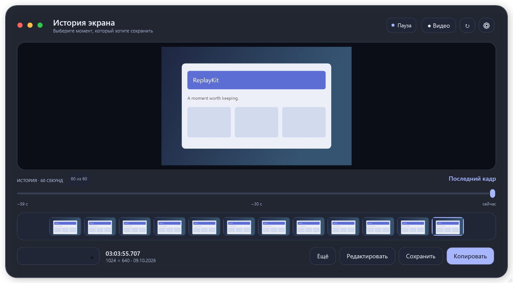

# domovoyproj

Приложения для Windows и веба: локальные инструменты, аккуратные интерфейсы и автоматизация.

## Проекты

<b>ReplayKit</b> — история экрана и запись видео для Windows

 

Последние секунды экрана в оперативной памяти, быстрый таймлайн, редактор кадров, локальный OCR, видеобуфер и запись MP4 с системным звуком и микрофоном.

`C#` · `.NET 8` · `WPF` · `DXGI` · `Media Foundation`

[Репозиторий](https://github.com/domovoyproj/ReplayKit) · [Скачать](https://github.com/domovoyproj/ReplayKit/releases/latest)

<b>PhotoSort</b> — локальная сортировка фото и видео

 

Поиск точных дублей, похожих кадров и серий, сравнение файлов, безопасная корзина и продолжение разбора после перезапуска.

`Rust` · `JavaScript` · `SQLite` · `Windows`

[Репозиторий](https://github.com/domovoyproj/PhotoSort) · [Скачать](https://github.com/domovoyproj/PhotoSort/releases/latest)

<b>VWP</b> — живые обои для Windows

 

Видеообои для нескольких мониторов, плейлисты, интерактивные сцены, реакция на звук, редактор и галерея коллекций.

`C#` · `.NET 8` · `WPF` · `Windows`

[Репозиторий](https://github.com/domovoyproj/VWP) · [Скачать](https://github.com/domovoyproj/VWP/releases/latest)

<b>momp</b> — web и desktop-клиент для Oh My Pi

 

Сессии и модели, чат в реальном времени, файловый менеджер, просмотр кода, квоты и нативный desktop-клиент.

`TypeScript` · `Next.js` · `Tauri` · `Bun`

[Репозиторий](https://github.com/domovoyproj/momp)

<b>Helper</b> — персональный PWA-помощник

 

Задачи, питание, сон, бюджет, рабочие смены, зашифрованный сейф паролей и резервные копии в одном устанавливаемом веб-приложении.

`JavaScript` · `PWA` · `Web Crypto` · `IndexedDB`

[Репозиторий](https://github.com/domovoyproj/helper-app) · [Открыть приложение](https://domovoyproj.github.io/helper-app/)

<b>avito-parser</b> — мониторинг и оценка объявлений

 

Автономный мониторинг объявлений с фильтрами, оценкой выгодности, веб-панелью, SQLite и уведомлениями в Telegram.

`Python` · `FastAPI` · `Playwright` · `SQLite`

[Репозиторий](https://github.com/domovoyproj/avito-parser)

<b>Know Your Russia</b> — интерактивная карта России

 

Карта с пользовательскими фото и видео, локальным хранением, модерацией и устанавливаемым offline-режимом.

`JavaScript` · `Bun` · `SQLite` · `Leaflet` · `PWA`

[Репозиторий](https://github.com/domovoyproj/know-your-russia)

<b>RuHub</b> — русификация GitHub

 

Браузерное расширение с переводом интерфейса GitHub и быстрыми действиями: открыть проект в VS Code Web или скачать ZIP.

`JavaScript` · `Chrome Extension` · `Manifest V3`

[Репозиторий](https://github.com/domovoyproj/github-ru)

<b>helper-files</b> — публичное файловое хранилище Helper

 

Инфраструктурный репозиторий для публичных вложений Helper: загрузка через GitHub Contents API, выдача через CDN и короткие ссылки.

`GitHub API` · `GitHub CDN` · `TinyURL`

[Репозиторий](https://github.com/domovoyproj/helper-files)

[Все репозитории](https://github.com/domovoyproj?tab=repositories)

